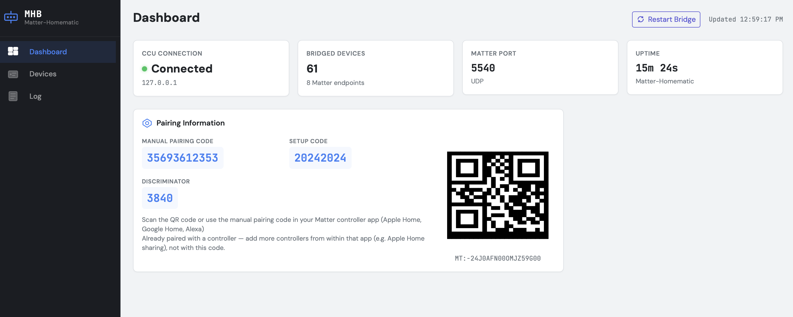
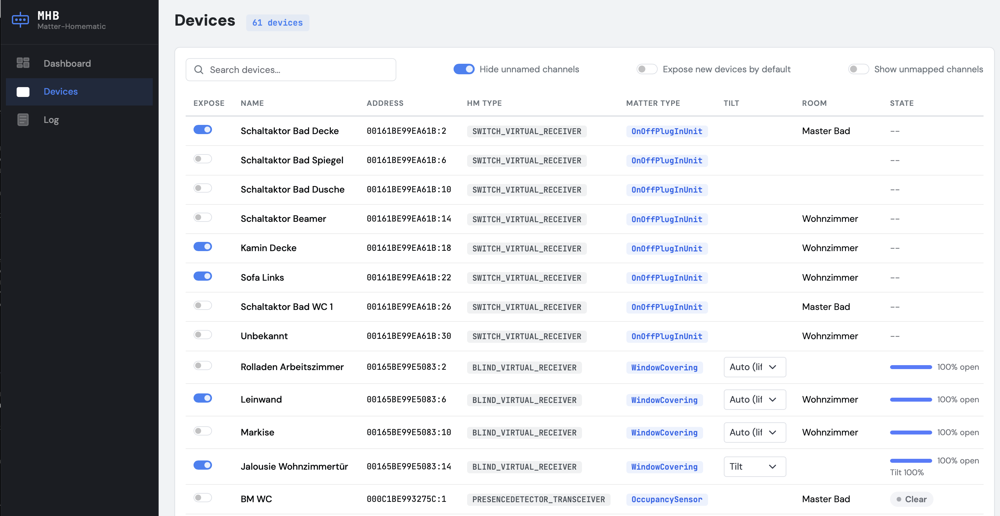

# Matter-Homematic Bridge

Expose **Homematic / Homematic IP** devices from a **CCU3 / RaspberryMatic** to **Matter** — and through it to Apple Home, Amazon Alexa, Google Home and Samsung SmartThings.

The bridge talks to the CCU over its native XML-RPC interfaces and presents every exposed channel as a Matter endpoint behind a single bridge accessory. Switches, dimmers, blinds (including venetian slat tilt), contact and presence sensors show up as first-class devices in your Matter ecosystem — local-only, no cloud, no Home Assistant in between.

It does for Matter what [hap-homematic](https://github.com/thkl/hap-homematic) does for HomeKit, and it is the mirror image of the sister project [shelly-homematic](https://github.com/nilsmotsch/shelly-homematic) (Shelly → Homematic). The two work together: Shellys bridged into the CCU by shelly-homematic are re-exported to Matter by this project like any native device.

> **Status: beta.** The bridge runs stably as an addon on a real CCU3 and is in daily use with Apple Home, but only part of the device matrix has been verified on real hardware — see [What has actually been tested](#what-has-actually-been-tested). Expect rough edges; issue reports with logs are very welcome.





## Features

- **One bridge, all ecosystems** — Matter multi-admin lets Apple Home, Alexa and Google Home control the same devices simultaneously.
- **Live state, both directions** — the bridge registers for the CCU's real-time event callbacks; wall-button presses and CCU programs are reflected in your Matter app within a second, and Matter commands are translated to `setValue` calls. A periodic resync covers missed events.
- **Blinds done right** — lift *and* venetian slat tilt (HmIP-FBL, HmIPW-DRBL4). Tilt support is auto-detected per channel, with a manual per-channel override in the Web UI for actuators whose firmware misreports it (e.g. a roller blind wired to an HmIP-FBL).
- **HmIP state handling** — commands go to the virtual receiver channel, but state is sourced from the authoritative transmitter channel, so positions stay correct no matter whether a device was operated from Matter, the CCU UI or a wall button.
- **CCU names and rooms** — channel names and room assignments are read from the CCU (no credentials needed when running as an addon) and used as Matter device labels.
- **Web UI** (default port 8080) — pairing QR code, per-channel exposure toggles, live device state, tilt override, log viewer, restart button.
- **Opt-in exposure** — nothing is announced to Matter until you enable it (per channel, or flip the default).
- **CCU addon packaging** — installable as a regular CCU addon via the WebUI, with a bundled Node.js runtime; runs on the stock eQ-3 CCU3 firmware as well as RaspberryMatic, and survives reboots and firmware updates.

## Supported devices

Mapping works on the Homematic *channel type*, not the device model, so most actuators and sensors of a given class work without explicit support — including wired (HmIPW), classic BidCos and Shellys impersonating BidCos devices via shelly-homematic:

| Homematic channel | Appears in Matter as | Examples |
|---|---|---|
| Switch actuator | On/Off plug-in unit | HmIP-PS/PSM/BSM/FSM, HmIPW-DRS8, HM-LC-Sw\* |
| Dimmer | Dimmable light | HmIP-BDT/PDT/FDT, HM-LC-Dim\* |
| Blind / shutter actuator | Window covering (lift, plus tilt for venetian) | HmIP-FBL, HmIP-BROLL/FROLL/BBL, HmIPW-DRBL4, HM-LC-Bl\*/Ja\* |
| Door/window contact | Contact sensor | HmIP-SWDO/SWDM, HM-Sec-SC\* |
| Motion / presence detector | Occupancy sensor | HmIP-SMI/SMO, HmIP-SPI, HM-Sec-MDIR |
| Temperature/weather sensor | Temperature sensor | HM-WDS\*, HmIP weather channels |
| Heating thermostat | Thermostat (heating) | HmIP-eTRV, HmIP-STH/STHD, HM-CC-RT-DN |
| Door lock | Door lock | HM-Sec-Key (Keymatic), HmIP-DLD |

Multi-channel devices (e.g. the 8-channel HmIPW-DRS8) produce one Matter device per channel; HmIP receiver groups are collapsed so each actuator channel appears once, not three times.

### What has actually been tested

Verified end-to-end on real hardware — eQ-3 CCU3 (firmware 3.87.x), bridge running as a CCU addon, commissioned with **Apple Home**:

| Device | Status | Notes |
|---|---|---|
| HmIPW-DRS8 (wired 8-ch switch) | ✅ Tested | Switching from Apple Home, live state when switched from CCU/wall button |
| HmIPW-DRBL4 (wired 4-ch blind) | ✅ Tested | Lift + venetian tilt, tilt auto-detect (roller vs. venetian channel modes), physical movement verified |
| HmIP-FBL (blind/shutter actuator) | ✅ Tested | Lift verified; reports tilt even for wired rollers — that's what the per-channel tilt override in the Web UI is for |
| HmIP-SPI (presence detector) | ✅ Tested | Presence events arrive live as occupancy |
| HmIP-SWDO (window contact) | ⚠️ Partially | Discovered and mapped on the real CCU; open/close events not yet systematically verified |
| HmIP-PSM, HmIP-BSM, HmIP-BDT | ⚠️ Simulated only | Verified against the pydevccu test double, not real hardware |
| Thermostats (HmIP-eTRV/STH, HM-CC-RT-DN) | ❌ Untested | Mapping exists and passes unit tests; no thermostat hardware available — feedback welcome |
| Door locks, motion (non-SPI), weather sensors | ❌ Untested | Implemented from paramset documentation — feedback welcome |
| Classic BidCos devices (HM-LC-\*, HM-Sec-\*) | ❌ Untested | Test installation is all-HmIP/HmIPW; the BidCos-RF interface code path is exercised, the device mappings are not |

Ecosystems: **Apple Home** is tested end-to-end (commissioning, control, live state). Alexa, Google Home and SmartThings speak the same Matter standard and are expected to work, but haven't been verified yet.

## Installation (CCU addon)

The recommended setup — the bridge runs directly on the CCU itself:

1. Download `matter-homematic-<version>.tar.gz` from the releases page (or build it yourself with `npm run build:addon`).
2. On the CCU WebUI: **Einstellungen → Systemsteuerung → Zusatzsoftware**, choose the tarball and install. The CCU reboots.
3. After the reboot, open the bridge Web UI at `http://<ccu>:8080`. Expose the devices you want under **Devices**.
4. Pair: the **Dashboard** shows a QR code and manual pairing code — scan it in Apple Home / Google Home / Alexa.

The addon bundles its own Node.js runtime — nothing else needs to be installed, and it runs on the original eQ-3 CCU3 firmware (which ships a Node far too old) as well as RaspberryMatic. Configuration, logs and the Matter fabric (your pairings) live in `/usr/local/etc/config/addons/matter-homematic/` and survive reboots, addon updates and firmware updates.

> **Note:** the bridge's event callback server uses port 9875 — the same default as hap-homematic. If you run both addons, change `ccu.callbackPort` in the config of one of them.

## Pairing and multi-admin

The QR code / manual code shown by the bridge works only for the **first** controller. To add a second ecosystem, the already-paired controller must open a new commissioning window:

- **From Apple Home:** bridge accessory settings → **Turn On Pairing Mode** → enter the generated one-time code in the other app (e.g. Alexa: Devices → + → Add Device → Matter → "device already in use with another app").
- **From Alexa:** device settings → **Other Assistants and Apps** → Add Another.
- **From Google Home:** device settings → **Linked Matter apps & services** → Link apps & services.

Each pairing window is time-limited (typically 15 minutes); afterwards the bridge stays connected to all fabrics, including across restarts. The bridge uses Matter's test vendor ID (`0xFFF1`), so every ecosystem shows an "uncertified device" warning during pairing — confirm to proceed. Removing the bridge from one app does not remove it from the others; a full reset (deleting the storage directory) wipes all pairings.

## Standalone usage (without the addon)

Runs anywhere Node 18+ runs, as long as the machine can reach the CCU and your Matter controllers can reach the bridge (same L2 network for mDNS):

```bash
git clone https://github.com/nilsmotsch/matter-homematic.git
cd matter-homematic
npm install
cp config.example.json config.json   # set ccu.host to your CCU's IP
npm run build && npm start
```

When running remotely, CCU names and rooms require CCU WebUI credentials via the `CCU_USER` / `CCU_PASSWORD` environment variables (running as an addon needs no credentials). Without them, devices fall back to raw channel addresses as labels.

## Configuration

`config.json` — a minimal file just needs the CCU host. The most relevant options:

```jsonc
{
  "ccu": {
    "host": "192.168.1.100",
    "callbackPort": 9875          // change if hap-homematic is installed
  },
  "bridge": {
    "port": 5540,                 // Matter (UDP)
    "name": "Matter-Homematic Bridge"
  },
  "devices": {
    "defaultExposed": false,      // opt-in per channel by default
    "exposed": {},                // managed via the Web UI
    "tilt": {}                    // per-channel tilt override (Web UI)
  },
  "web": { "enabled": true, "port": 8080 },
  "logging": { "level": "info" }
}
```

Everything under `devices` is normally managed from the Web UI, not by hand. CLI overrides (`--ccu=`, `--port=`, `--passcode=`) and a `CONFIG_PATH` env var are also supported. Secrets never go in config files — credentials are env-vars only.

### Blind tilt: auto-detect and override

Venetian blinds get both lift and slat-tilt controls in Matter; rollers get lift only. The bridge auto-detects this from the channel's live paramset. One case can't be auto-detected: the HmIP-FBL always reports tilt capability even when a plain roller is physically wired to it. For those channels, set the **Tilt** dropdown in the Web UI device list to *Off* (or *Tilt* to force tilt on). Changing it requires a bridge restart to apply.

## How it works

```
Apple Home / Alexa / Google Home / SmartThings
        │ Matter (mDNS + UDP 5540)
        ▼
  MatterBridge (matter.js, bridged endpoints)
        │
  DeviceMapper (channel type ↔ Matter device type, value conversion)
        │
  CcuConnector (XML-RPC client + event callback server :9875)
        │ BidCos-RF :2001 / HmIP-RF :2010 / VirtualDevices :9292 / extra ipc interfaces
        ▼
  CCU3 / RaspberryMatic ──868 MHz / wired──► Homematic devices
```

The CCU pushes state changes to the bridge's callback server in real time; names and current values are additionally read via the CCU's ReGa scripting engine, which is far more reliable than XML-RPC reads on real firmware. Considerable care went into compatibility quirks of real CCU3 firmware — explicit `Content-Length` on callback responses, answering HMServer's `listDevices` probe, transmitter-vs-receiver state channels — documented in comments where it matters in the code. A more detailed design overview lives in [`docs/architecture.md`](docs/architecture.md).

## Troubleshooting

- **Bridge not discovered during pairing** — controller and bridge must be on the same network/VLAN; mDNS (UDP 5353) and the Matter port (UDP 5540) must not be filtered. Also: the bridge only advertises once **at least one device is exposed** — an empty bridge is invisible by design of matter.js.
- **Pairing code rejected** — the printed code only works for the first controller; see [Pairing and multi-admin](#pairing-and-multi-admin). After a failed half-pairing, delete the bridge's storage directory to reset commissioning.
- **No live updates / stale state** — check that nothing else occupies the callback port (hap-homematic also defaults to 9875), and that the CCU can reach the bridge host on that port.
- **Devices missing from the Web UI list** — the "Hide unnamed channels" filter hides channels that still carry their CCU default name (address-based). Turn it off to see unconfigured channels, e.g. unused relay outputs.
- **Logs** — Web UI **Log** tab, or `/usr/local/etc/config/addons/matter-homematic/matter-homematic.log` on the CCU.

## Limitations

- Matter's device-type catalog is narrower than Homematic's — keypress channels, illumination on HmIP-SPI, and CCU programs/variables are not exposed.
- Matter bridges are limited to roughly 150 endpoints; expose selectively on large installations.
- Thermostat support is implemented but unverified on hardware (see test status).

## Development

```bash
npm run dev          # run from source (ts-node, reads ./config.json)
npm test             # Jest test suite
npm run lint         # eslint
npm run build:addon  # build the CCU addon tarball (dist-addon/)
```

For end-to-end testing without real hardware there is a [pydevccu](https://github.com/danielperna84/pydevccu)-based test double (`scripts-pydevccu.py`); `@matter/nodejs-shell` works well as a test commissioner. For setting up an isolated test CCU on a spare Raspberry Pi, see [`docs/test-ccu-setup.md`](docs/test-ccu-setup.md). `scripts/deploy.sh` provides a fast inner loop against a real CCU (pushes the bundle over SSH and restarts the addon); it reads `CCU_HOST`/`CCU_SSH_USER`/`CCU_SSH_PASSWORD` from a gitignored `.env.local`.

## Acknowledgments

- [matter.js](https://github.com/project-chip/matter.js) — the Matter protocol implementation doing the heavy lifting
- [hap-homematic](https://github.com/thkl/hap-homematic) — inspiration and reference for talking to the CCU
- [RaspberryMatic](https://github.com/jens-maus/RaspberryMatic) — CCU software
- [pydevccu](https://github.com/danielperna84/pydevccu) — CCU test double used in development

## Related projects

- [shelly-homematic](https://github.com/nilsmotsch/shelly-homematic) — the sister project: Shelly devices → Homematic CCU
- [hap-homematic](https://github.com/thkl/hap-homematic) — HomeKit bridge for Homematic
- [Matterbridge](https://github.com/Luligu/matterbridge) — generic Matter bridge with plugins

## License

[MIT](LICENSE)
